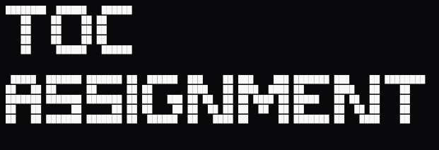
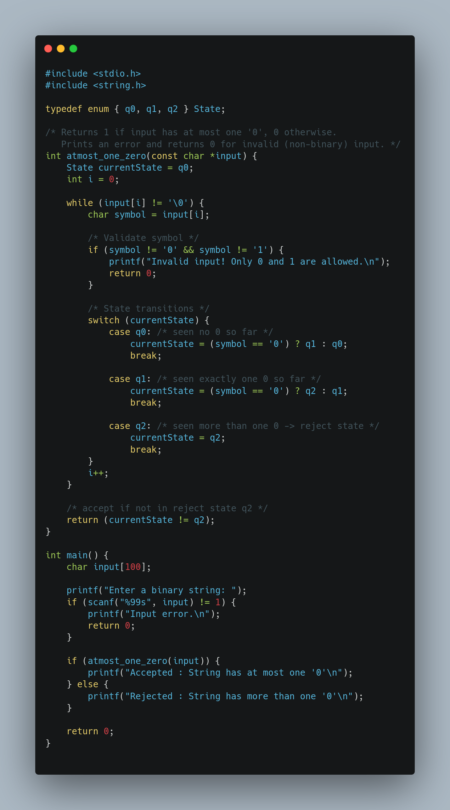
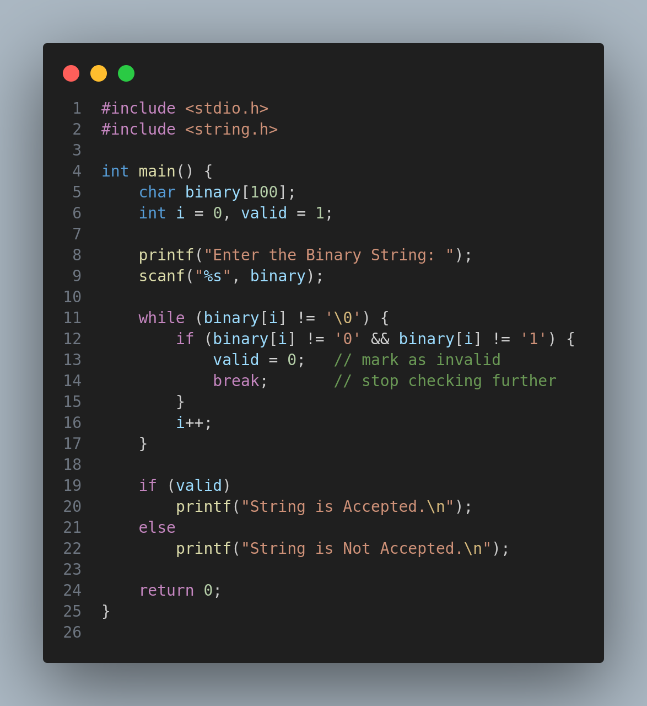

  

 
                                                                                                                                  
---

# 🧮 Theory of Computation (TOC) – 5th Semester Assignments  

This repository contains my **TOC (Theory of Computation)** assignments implemented in **C language**.  
The programs demonstrate core concepts like **Finite Automata, String Validation, and Computation Models**.  

---

## 📂 Contents  

- ✅ Atmost One Zero  
- ✅ Atleast One Zero  
- ✅ Exact One Zero  
- ✅ Count 0s and 1s  
- ✅ Odd/Even 0s and 1s  
- ✅ Binary String Validator  

---

## ⚡ How to Run  

Clone the repo:  
git clone https://github.com/AnilYadav17/Theory-of-Computation-Assignments
cd Theory-of-Computation-Assignments

Compile & run any program:
gcc filename.c -o output
./output

🖼️ Sample Outputs
(Automata State Diagrams are included as .png files)
| Program             | Diagram Example                             |
| ------------------- | ------------------------------------------- |
| Atmost One Zero     |  |
| Exact One Zero      |    |
| Binary String Check |   |

---
🎯 Tech Stack

Language: C
Concepts: Finite Automata, Regular Languages, String Checking
Tools: GCC Compiler, GitHub

---

📜 License

This project is licensed under the MIT License

---

🌟 Badges
# 🧮 Theory of Computation (TOC) – 5th Semester Assignments

  
  
  

---

✍️ Submitted By

Anil Yadav
🎓 B.Tech CSE – 5th Semester
📌 Enrollment No: 0873CS231014

